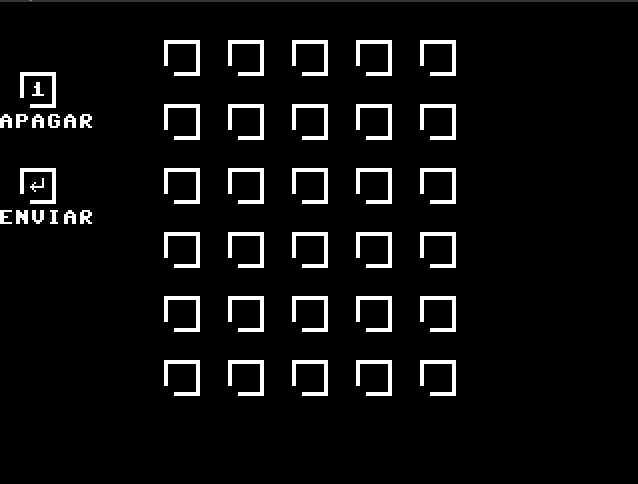
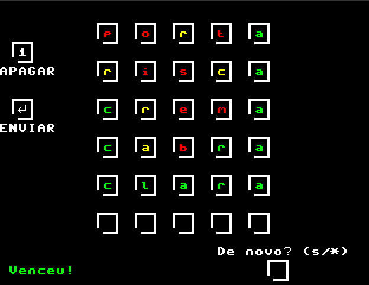

# Item 1 - Assembleco
Inspirados no famoso jogo Wordle, especialmente em sua versão chamada ["Letreco" (desenvolvida por Gabriel Toschi)](https://github.com/gabtoschi/letreco), decidimos criar uma versão em Assembly para o Processador do ICMC. O jogo consiste na advinhação de uma palavra de 5 letras dentre 6 tentativas. Para auxiliar, são dadas dicas sobre a existência e posição das letras em cada tentativa. Para tanto, elas são coloridas com:
* Vermelho: indicando que a letra não está presente na palavra-resposta
* Amarelo: indicando que a letra está presente na palavra-resposta, mas em outra posição
* Verde: indicando que a letra está presente na palavra-resposta na mesma posição

Obs.: mesmo em caso de repetição de letras, cada uma delas conta apenas uma vez. Ou seja, se a palavra-resposta for "forma" e a tentativa for "bolos", a primeira letra 'o' de "bolos" ficará verde, mas a segunda ficará vermelha.

O programa começa com uma tela inicial e aguarda o usuário digitar alguma tecla. Este tempo de aguardo é utilizado para gerar um número pseudoaleatório que irá selecionar a palavra-resposta da primeira partida.

A partida inicia com 6 linhas 5 quadrados, uma para cada tentativa. A primeira delas é feita sem nenhuma dica na primeira linha de quadrados. Basta digitar a palavra (com letras minúsculas) e apertar ENTER para confirmar. Caso queira apagar, utiliza-se o '1'. 

Após confirmar a tentativa, ela é impressa com dicas de cores. No exemplo acima, as cores indicam que a resposta não tem as letras 'p', 'o', nem 't', que termina com a letra 'a' e que possui a letra 'r', mas não na posição central.

No exemplo, a partida for vencida na quarta tentativa. Ao final da partida, é perguntado ao usuário se ele gostaria de jogar uma nova rodada. Caso queira, ele deve escrever 's' dentro do quadrado na resposta e confirmar com ENTER. Caso não, base escrever qualquer outra letra, como 'n', e também confirmar com ENTER. Anter da confirmação, pode-se também apagar com a tecla '1'.

A derrota ocorre quanto o jogador não consegue adivinhar a palavra-resposta dentro das 6 tentativas. Neste caso, a resposta é revelada.

# Item 2 - Construir o Hardware do Processador em VHDL na FPGA

# Item 3 - Implementar Nova Instrução na Arquitetura do Processador

# 3.1. Modificar o projeto na FPGA
# 3.2. Modificar o Montador para que reconheça a nova Instrução
# 3.3. Modificar o Manual do Processador, descrevendo sua nova Instrução (e alteraçao na Arquitetura)
